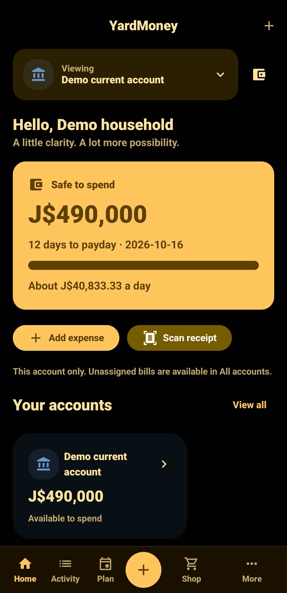
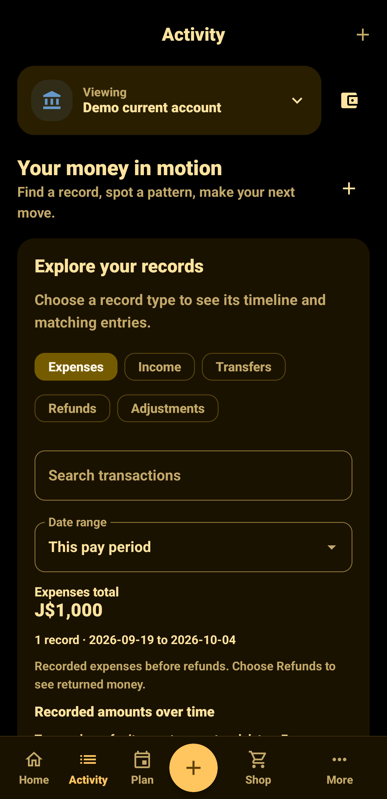
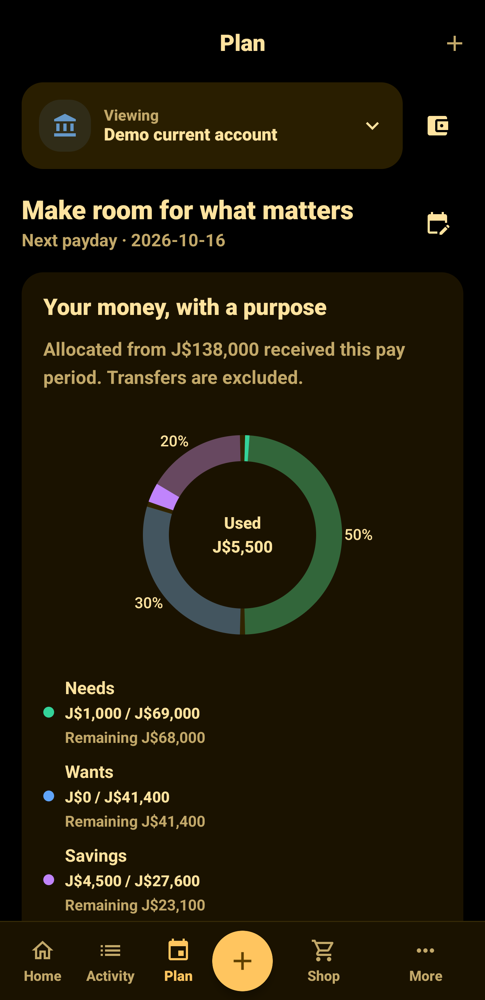
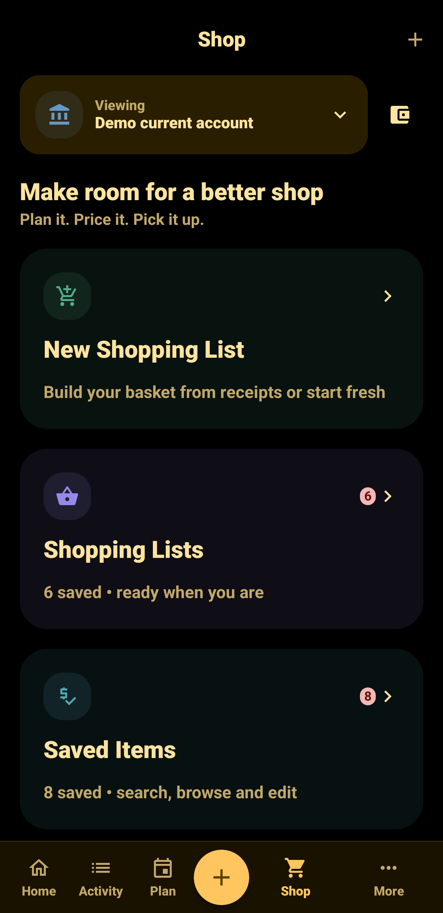
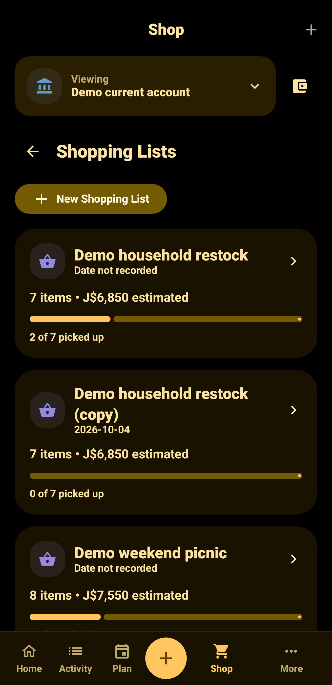
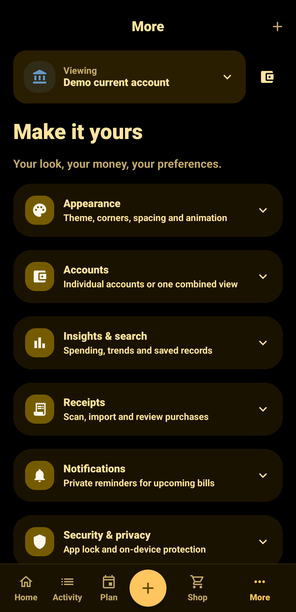

# YardMoney

**Understand your money before payday.** YardMoney is an Android budgeting app for managing Jamaican dollars, everyday spending, bills, savings and receipts in one place.

The current **0.4.2 local pilot** stores financial records on your device and works without an account. It uses a green Material interface with adjustable themes, spacing, corners and motion. Optional online accounts and cloud backup are planned for the first public release; they are not implemented in this pilot.

[User guide](#using-yardmoney) · [Developer setup](#developer-setup) · [Testing](#testing-and-verification) · [Architecture](#architecture-and-source-map) · [Issues](https://github.com/geo-afk/YardMoney/issues) · [MIT license](LICENSE)

## Contents

- [Project status](#project-status)
- [Who it is for](#who-it-is-for)
- [Features](#features)
- [Screenshots](#screenshots)
- [Install and start](#install-and-start)
- [Using YardMoney](#using-yardmoney)
- [Privacy, security and backup](#privacy-security-and-backup)
- [Developer setup](#developer-setup)
- [Build and install from source](#build-and-install-from-source)
- [Testing and verification](#testing-and-verification)
- [Architecture and source map](#architecture-and-source-map)
- [Financial and receipt rules](#financial-and-receipt-rules)
- [Troubleshooting](#troubleshooting)
- [Contributing and support](#contributing-and-support)
- [Release roadmap](#release-roadmap)
- [Documentation and references](#documentation-and-references)
- [License](#license)

## Project status

| Item | Current state |
| --- | --- |
| Version | 0.4.2, Android version code 13 |
| Availability | Development pilot; no production store release configured |
| Currency | Jamaican dollars (JMD), displayed as J$ where applicable |
| Android support | Android 8.0 / API 26 minimum; compile and target API 36 |
| Accounts and connectivity | Local use without sign-in; optional identity and cloud backup remain planned |
| Latest host verification | 138 unit tests passed on 6 October 2026 |
| Latest device verification | Full Pixel 8 Pro run: 105/106 passed; corrected test assertion and new CSV flow passed in focused reruns |
| Latest build checks | Debug assembly, host tests, lint and instrumentation APK compilation passed; release/signature/alignment checks were not rerun for capture/import |
| Android lint | Zero errors and 48 warnings on 6 October 2026 |
| License | MIT; copyright 2026 Geovanni Stewart |

The capture/import checks were recorded on **6 October 2026** using the isolated `jm.yardmoney.testhost` installation on a Pixel 8 Pro running Android 17. The full device run passed 105 of 106 tests; its remaining failure was an expense-split sign expectation in a new test. After correcting that assertion, the focused import suite passed all six tests, including CSV sharing, rotation, explicit import and undo. The latest full suite was not repeated after the final date-format picker correction. Optimized release assembly and APK signature/alignment checks were not rerun for these changes.

Camera usability, real-receipt accuracy, fresh-device recovery, background reminders and a broader accessibility/device matrix still need manual validation. See [the device checklist](docs/07-device-validation.md).

## Who it is for

YardMoney helps people who want to:

- See what is safe to spend before their next payday.
- Keep bills and protected savings separate from everyday spending money.
- Start with a 50% needs, 30% wants and 20% savings plan, then customize it.
- Record spending manually or use receipt scanning to reduce typing.
- Review spending by category and compare shopping prices recorded from their own receipts.
- Keep control of local records without a required online account.

This pilot is a manual financial tracker. It does not connect to banks, move money, calculate full payroll or provide multi-currency accounting. Its guidance depends on the balances, transactions and commitments you enter.

## Features

| Area | What you can do |
| --- | --- |
| Home | Review safe-to-spend guidance, daily guidance, upcoming commitments and your allocation chart |
| Activity | Switch record types and date ranges to explore a column chart and matching list; record income, expenses, transfers, refunds and adjustments |
| Plan | Customize category percentages, review allocation donuts and category activity, manage bills and savings goals |
| Shop | Build checklists, use recorded product observations and manual estimates, and review price coverage and affordability |
| More | Expand grouped settings for appearance, accounts, insights, reminders, security and data controls |
| Receipts | Capture or import images, adjust crop/perspective, run bundled OCR, review extracted items and reconcile totals |
| Reports | Search local records, review merchant/category/monthly summaries, compare date periods and export CSV |
| Appearance | Choose light, dark, AMOLED or system modes; dynamic colors or custom accents; corners, spacing and motion |
| Quick Add | Parse a smart line, edit suggested fields, reuse recent expenses and manage merchant category rules |
| Share and paste | Review shared alert text, crop shared photos or paste alert text explicitly; app lock protects incoming content |
| Statement import | Map CSV columns and dates, review rows, skip duplicates, import selected records and undo a batch |
| Security | Encrypted database, saved receipt previews, optional device authentication, photo-free password-encrypted backups and local deletion |

### Interface details

The app uses Material calendar date selection, dollar prefixes and grouped currency input, themed navigation, anchored dropdowns, expandable settings and a scrollable money-entry sheet. Home and Plan donuts compare live category usage with allocated targets, showing used / allocated values, remaining amounts and explicit over-target figures. Their solid portions update as records change.

The money-entry form scrolls independently of its sheet. Returning to the top keeps it open; a new deliberate downward pull at the top closes it. The fixed Save action remains reachable with the keyboard open.

Main navigation follows the selected motion preference: Calm, Slide, Expressive or Off. Corner preferences are Square, Soft and Rounded; spacing preferences are Compact and Comfortable. Wider windows use a navigation rail.

### Reliability and responsiveness

The system authentication prompt opens when app authentication is required. If you cancel or authentication fails, YardMoney stays locked and offers an **Unlock** action to try again. If the device screen lock was removed, the lock screen explains how to restore access. Forms and navigation state are retained across lock/unlock.

Date pickers disable dates outside the range accepted by the relevant form. Exceeded category limits display **Over by** in the error color, section titles are marked as headings for TalkBack, and reminders use a dedicated status-bar icon. Receipt-photo processing handles memory exhaustion with a readable error, while reminder retries are capped.

Shopping checkbox updates, category-rule edits and statement-mapping updates read their own tables separately from the ledger, avoiding a full ledger reload for those edits. Recurring bill generation looks up existing occurrences once per bill series, and reports/category-limit totals are reused when their underlying data has not changed. These are implementation improvements; no before/after speed benchmark has been recorded.

## Screenshots

Captured from YardMoney 0.4.2 Demo on a Pixel 8 Pro using fictional records and a customized dark theme. Tap a picture to view it at full size.

| Home | Activity | Plan |
| :---: | :---: | :---: |
| [](docs/screenshots/home-app-only.png) | [](docs/screenshots/activity-app-only.png) | [](docs/screenshots/plan-app-only.png) |

| Shop | Shopping lists | More |
| :---: | :---: | :---: |
| [](docs/screenshots/shop-app-only.png) | [](docs/screenshots/shopping-lists-app-only.png) | [](docs/screenshots/more-app-only.png) |

## Install and start

You need a device running Android 8.0 or newer. This repository contains source code; generated APKs, local SDKs and signing keys are excluded from Git.

For a development installation, follow [build and install from source](#build-and-install-from-source), or obtain a verified development APK from the maintainer. The [0.4.2 development prerelease](https://github.com/geo-afk/YardMoney/releases/tag/v0.4.2) includes an installable APK and checksum from an earlier source revision. Build the current source to try the newer capture and statement-import features; this README update does not publish a replacement APK. Play Store distribution is not configured.

The debug build uses a development signing certificate. The optimized release build is unsigned until release signing is configured; it cannot be installed as a finished production release.

On first launch:

1. Enter your real starting balances and payday information.
2. Optionally enter typical take-home pay to guide your plan.
3. Start with the default allocation or customize it in Plan.
4. Record actual money received, bills and spending as they happen.
5. Review the Home page before deciding what to spend.

The app starts with your own empty data. It does not preload fictional money. **Entering typical pay does not add money to an account.** Record actual income when you receive it.

## Using YardMoney

### Accounts and starting balances

Create the accounts you want to track, such as cash, a current account, savings or a wallet. An account can be included in spendable money or marked as protected. Protected savings remain visible without becoming available spending money.

A starting balance records money already held. Income records money newly received. Keep these concepts separate so your spending guidance and income-based allocation stay meaningful.

### Needs, wants and savings

The default allocation divides recorded income into 50% needs, 30% wants and 20% savings. For example, J$82,000 of received income allocates J$41,000 to needs, J$24,600 to wants and J$16,400 to savings.

You can change the percentages. They must total exactly 100%; the rebalance preview helps you review the result. Category targets describe your plan, while category activity shows what you recorded. An allocation is not a bank transfer or an automatic savings deposit. Savings usage includes category spending plus net transfers into SAVINGS-type accounts for the current period; withdrawals reduce the funding measure. Ordinary transfers remain excluded from expenses.

### Safe to spend and daily guidance

Safe to spend begins with balances in included accounts, then subtracts applicable outstanding commitments due by the next payday, including commitments without a due date. Protected account balances are excluded from the starting pool.

For example, J$42,000 of included balances with J$23,580 reserved leaves J$18,420 safe to spend. With seven days until payday, daily guidance is approximately J$2,631.42. It uses whole cents and may leave a small remainder.

The app does not subtract category targets again as additional commitments. Daily guidance is unavailable when there are no days remaining or no positive safe amount. Review missing or incorrect entries before relying on a figure.

### Record money

Use the plus action and choose the appropriate transaction:

- **Income:** money you actually received.
- **Expense:** spending from an account, with a category or category splits.
- **Transfer:** movement between your own accounts; it is not new income or ordinary spending.
- **Refund:** returned spending, optionally linked to the original expense.
- **Adjustment:** a correction to reconcile a balance with reality.

Enter the amount, account and date, then review optional details before saving. The grouped form scrolls while the Save action remains reachable. Transfers need different source and destination accounts.

### Quick Add and category rules

Tap the **Quick Add** item in the bottom navigation to open Quick Add. Its labeled icon uses the same size and spacing as the other navigation items. Preview chips open field-specific help; edit the fields below them, or choose **More details** to open the full expense form. Type a smart line such as `taxi 600 cash yesterday` or `Hi-Lo 8,450 card yesterday`, using the name of an account you created. Account matching ignores letter case. Amounts can use commas, decimals, a currency prefix or a `k` abbreviation, such as `lunch 1.2k`.

The amount, category, account and date suggestions remain editable. Missing or ambiguous values show **Not specified**; choose them before saving. The parser understands today, yesterday, weekdays and day/month dates, and does not accept future transaction dates. Parsing never saves money automatically.

Up to six repeat chips suggest frequent/recent expense combinations from the last 60 days. Tap to prefill an expense or long-press to open detailed editing. Changing a category can offer an **Always use** snackbar action. Accept it to save a merchant rule; manage exact/contains rules and optional account bindings in **More → Category rules**. Rules apply to Quick Add, detailed expense entry, reviewed receipt confirmation, shared/pasted alerts and statement imports. A more specific matching rule takes priority.

### Share or paste an alert

From another app's Share menu, choose YardMoney for plain text, a receipt image or a CSV statement. When app lock is enabled, incoming content waits until you authenticate. An existing editor stays open before the new share is handled.

Shared text opens a review sheet with amount, merchant, income/expense direction and date suggestions. Tap **Review record**, choose missing fields and confirm the transaction in the normal editor. Generic words such as purchase, payment, debited, received and credited help identify direction; conflicting directions or multiple amounts need your review.

For clipboard capture, open **Quick Add → Paste alert text**, then tap **Paste alert text** in the review sheet. The app reads the clipboard only on that tap. Shared photos open the existing crop/OCR flow; CSV files open the statement importer. None of these entry points auto-save records.

### Import a statement CSV

1. Open **More → Backup & data → Import transactions**, or share a CSV file to YardMoney.
2. Choose a UTF-8 CSV file. Commas, semicolons and tabs are detected; quoted commas/newlines, a UTF-8 BOM and CRLF line endings are supported. Limits are 20 MB and 20,000 data rows.
3. Choose the target account and whether the first row contains column names. Map date and description, then either a signed amount column or separate debit and credit columns. Balance is optional.
4. Choose the date format explicitly: `dd/MM/yyyy`, `MM/dd/yyyy` or `yyyy-MM-dd`. This resolves dates such as `01/02` without guessing.
5. Tap **Preview rows** and review each include toggle. Invalid rows cannot be imported. Possible duplicates are skipped by default; enable **Allow selected duplicate rows** before deliberately selecting them.
6. Confirm the selected rows. The importer shows progress and saves the batch atomically; a rejected write leaves no partial batch. Matching category rules apply to imported descriptions.
7. Use **Undo import** on the result screen or under **Previous imports** to remove that batch. Remove linked refunds or receipts first if they prevent undo.

Signed negative amounts are expenses and positive amounts are income. Debit/credit columns represent spending/receipts separately; grouped amounts and parentheses for negative signed amounts are supported. Duplicate comparison uses the account, date, signed amount and whitespace-normalized description. The account's column mapping is remembered. Importing the same file with the same account and mapping again adds no records; undo the batch before changing its row selection and reimporting.

The raw statement file is not copied into app storage. Parsed rows stay in memory while reviewing, including through rotation and lock/unlock. Saved import records retain batch provenance so undo is possible.

CSV import is separate from backup restoration. YardMoney's transaction export includes a type column and positive expense amounts; convert that export to signed amounts or debit/credit columns before using this importer. Use an encrypted portable backup to restore the complete app state.

### Bills, commitments and savings goals

Add recurring bills and reserve money for upcoming obligations. Partial payments reduce the outstanding commitment as well as the relevant account balance. Review the remaining amount rather than treating a partially paid bill as settled.

Recurring bills appear once with the next unpaid date; expand other scheduled dates to review or pay individual occurrences. Repeated saves of one reservation request are protected against duplicate insertion.

Savings reservations earmark money still held in a spendable account. Moving that money into a protected savings account should not reserve it a second time. Track contributions and withdrawals against goals to keep goal progress aligned with your recorded movements.

### Scan and review receipts

1. Capture a photo or import an image. Use even lighting, avoid glare and keep the paper in focus.
2. Review the image, crop and perspective. Ambiguous scenes retain the full image rather than inventing a paper boundary.
3. Run OCR and inspect the merchant, date, currency, items and total.
4. Correct recognition errors and reconcile the receipt before confirming it.
5. Save the reviewed receipt and its expense relationship only when the figures are correct.

OCR suggestions do not post money automatically. Duplicate warnings need review, and an existing expense can be linked rather than recording the same purchase twice. Total-only receipts are supported when item extraction is unsuitable. Bundled recognition and tiled processing support long receipts, but real Jamaican receipt accuracy has not yet been measured against a representative corpus.

### Shopping and reports

Reviewed receipt items can supply product and price observations with branch/date and quantity information. Use them alongside manually entered estimates in a shopping checklist. Coverage indicators help show which estimates have supporting observations; an old observation is not a live retailer price.

Use local insights to search, compare spending periods and inspect category or merchant totals. CSV export creates a readable financial file for use elsewhere. Text that could be interpreted as a spreadsheet formula is neutralized on export. CSV is not an encrypted recovery backup.

## Privacy, security and backup

Financial records are held locally. The app manifest explicitly removes the Internet permission in this pilot. This does not establish a blanket zero-telemetry claim for the device, OS or bundled third-party components, nor does it complete a privacy audit.

| Protection | Implementation and practical limit |
| --- | --- |
| Ledger storage | Room backed by SQLCipher; database encryption key protected through Android Keystore |
| Receipt capture | New scans use temporary image processing; reviewed text/items supply saved receipt previews; photos are excluded from new backups and legacy restores |
| App access | Optional system biometric/device-credential authentication; prompt appears when authentication is required |
| Screen content | Secure-window protection restricts ordinary screenshots and screen capture |
| OS backup | Automatic app backup disabled; explicit data-extraction exclusions configured |
| Portable backup | Password-derived authenticated encryption, independent of the original device's Keystore |
| Local control | Export and deletion tools available in the app |

Portable backups use AES-GCM and PBKDF2-HMAC-SHA256 with 600,000 iterations and a fresh salt. The backup password must contain at least 12 characters. Keep both the backup file and its password somewhere you can recover them. The pilot has no online password-recovery service.

New backups use **format 5**, including merchant category rules, import batches, provenance and account column mappings. Restoration accepts formats **1–5** and supplies empty metadata tables when an older format lacks them. Receipt photos are never included in new backups. Restoring a legacy backup keeps its financial/text records and receipt previews but does not restore original photos.

Uninstalling the app, clearing its storage or losing the device can remove local records and keys. Create a portable backup before destructive actions. Test restoration with fictional records before depending on it for recovery. Do not treat a database file copied from private storage or a CSV export as a substitute for the supported encrypted backup.

### Delete local records and recover unreadable data

**Delete local records** clears database records, including category rules and statement batches/mappings, plus stored receipt files, saved shop items, the selected account scope and any in-progress shopping list. Appearance preferences are separate from personal financial records. Save a portable backup first if you want to retain the data.

If YardMoney cannot open its database or encryption key, try **Retry** first. **Start over** requires typing `DELETE` and permanently removes the local database, its wrapped encryption key, stored receipt images and saved personal preferences. The app can then start empty and restore a portable backup through its normal data controls. Backups you saved elsewhere are not deleted; starting over does not recover unreadable records by itself.

Camera access is used for receipt capture; notifications are used for bill reminders; biometric support enables optional app authentication. Device/OS permissions and notification settings can affect these features. Do not publish receipts, balances, backup passwords or exported financial files in issue reports.

## Developer setup

### Toolchain

| Component | Project configuration |
| --- | --- |
| Language | Kotlin 2.3.20; Java/Kotlin bytecode target 17 |
| Android UI | Jetpack Compose; Compose BOM 2025.10.01; Material 3 |
| Android Gradle Plugin | 9.0.1 |
| Gradle | Wrapper 9.1.0, with distribution checksum |
| Verified Gradle runtime | Java 24 |
| Android SDK | Platform API 36 and build-tools 36.0.0 |
| Data | Room 2.8.4 and SQLCipher Android 4.19.1 |
| Code generation | KSP 2.3.11 |
| Receipt tools | CameraX 1.5.2; bundled ML Kit text recognition 16.0.1 |
| Device tests | AndroidX runner 1.7.0, JUnit extension 1.3.0, Espresso 3.7.0 |

Use the checked-in wrapper and dependency lockfiles. Java 24 is the verified runtime; the bytecode target of 17 does not mean the Gradle build has been validated with every Java 17 installation. Do not upgrade dependencies solely to match an IDE suggestion without checking compatibility and rerunning verification.

### Clone and open

```powershell
git clone https://github.com/geo-afk/YardMoney.git
Set-Location YardMoney
```

Open the repository root in an Android Studio version that supports AGP 9.0.1. Select a suitable Gradle JDK and install SDK platform 36 and build-tools 36.0.0 through SDK Manager. Allow the initial Gradle dependency download.

Configure the SDK through the IDE or an ignored root `local.properties` file. For example, replace this illustrative path with your own:

```properties
sdk.dir=C:/Users/YourName/AppData/Local/Android/Sdk
```

Alternatively, the Windows helper downloads checksum-verified official SDK archives into the project:

```powershell
.\scripts\bootstrap-sdk.ps1
```

The helper writes `local.properties` and installs the platform, build tools and ADB. It does not install an emulator/system image, change global settings or write license-acceptance records. If its pinned archives are no longer available, use Android Studio's SDK Manager and configure `local.properties` yourself.

### Windows command-line environment

Set `JAVA_HOME` to your actual Java 24 installation. The path below matches the environment used for project verification:

```powershell
$env:JAVA_HOME = 'C:\Program Files\Java\jdk-24'
$env:Path = "$env:JAVA_HOME\bin;$env:Path"
$env:GRADLE_USER_HOME = Join-Path (Get-Location) '.gradle-home'
.\gradlew.bat --version
```

The SDK, cache directories, machine-specific settings and signing keys are excluded from version control. Android SDK/build dependency downloads need connectivity during setup; installed budgeting flows operate locally.

## Build and install from source

### Debug build

```powershell
.\gradlew.bat :app:assembleDebug --console=plain
```

The installable output is `app/build/outputs/apk/debug/app-debug.apk`. Connect an authorized device and install through Android Studio, or run:

```powershell
.\gradlew.bat :app:installDebug --console=plain
```

An update requires the same application ID and compatible signing certificate. A fresh machine may generate a different debug key; do not uninstall an existing installation holding real data merely to work around a signature mismatch. Back up and plan the transition first.

### Optimized release build

```powershell
.\gradlew.bat :app:assembleRelease --console=plain
```

Output: `app/build/outputs/apk/release/app-release-unsigned.apk`. R8 shrinking is enabled. Production signing, signed bundles, release credentials and store submission are not configured. Keep signing material outside Git.

### macOS and Linux

The wrapper can run without the Windows helper scripts. Configure a compatible Java runtime and Android SDK first, then use:

```bash
chmod +x gradlew
./gradlew :core:test :app:testDebugUnitTest :app:assembleDebug :app:assembleDebugAndroidTest :app:lintDebug :app:assembleRelease --console=plain
```

Windows is the verified development environment. These equivalent wrapper commands are provided for portability; they are not evidence of a completed macOS/Linux validation run.

## Testing and verification

### Build and check the debug APK

After configuring the Java and SDK environment above, run:

```powershell
.\gradlew.bat :app:assembleDebug :core:test :app:testDebugUnitTest :app:lintDebug --console=plain
```

This produces a signed development APK at `app/build/outputs/apk/debug/app-debug.apk` and runs host tests and debug lint. It does not execute device tests or assemble the optimized release. To verify the APK using build-tools 36.0.0, substitute your actual SDK directory:

```powershell
$sdkDirectory = 'C:\Users\YourName\AppData\Local\Android\Sdk'
& "$sdkDirectory\build-tools\36.0.0\apksigner.bat" verify --print-certs '.\app\build\outputs\apk\debug\app-debug.apk'
& "$sdkDirectory\build-tools\36.0.0\zipalign.exe" -c -P 16 4 '.\app\build\outputs\apk\debug\app-debug.apk'
```

### Full local verification

```powershell
.\scripts\verify.ps1
```

This runs core tests, app host tests, debug assembly, instrumentation APK assembly, debug lint and optimized unsigned release assembly. It compiles device tests but cannot execute them without a running Android device.

### Run device tests

Enable Developer options and USB debugging, use a data-capable cable, unlock the phone and approve the computer. Windows may require an OEM USB driver. For an emulator, create and start a virtual device in Android Studio's Device Manager.

With the project-local SDK:

```powershell
& '.\.tooling\android-sdk\platform-tools\adb.exe' devices
.\scripts\verify.ps1 -DeviceTests
```

If your SDK is elsewhere, use its `platform-tools/adb` instead. A connected target should show `device`; `unauthorized` means the phone still needs authorization. The script installs the app and test APK and runs the instrumentation suite. Use a dedicated test device or test profile and fictional records for manual work.

For a faster device-only rerun after configuring the environment:

```powershell
.\gradlew.bat :app:connectedDebugAndroidTest -PdeviceTestInstall=true --console=plain
```

### Explore with fictional data

Run `./scripts/install-demo.ps1` to build and install **YardMoney Demo**, a separate copy with six months of fictional records. Your normal YardMoney database stays separate. The fixture includes fictional transactions, receipts, goals, bills and shopping lists. See [demo installation](docs/18-demo-data.md) for setup, repeat runs and reset instructions.

### Evidence and reports

On **6 October 2026**, `:app:assembleDebug :core:test :app:testDebugUnitTest :app:lintDebug :app:assembleDebugAndroidTest` passed for the capture/import source. All **138 host tests passed** (79 core and 59 app tests); lint reported **0 errors and 48 warnings**. Kotlin compilation runs as part of the build.

`:app:connectedDebugAndroidTest -PdeviceTestInstall=true` ran the full suite on a Pixel 8 Pro running Android 17: **105/106 passed**. The failing test expected a negative expense-category split, while the ledger stores positive expense splits and negative account movements. After correcting that expectation and preserving date-format labels in the picker, the focused repository/import UI suite passed **6/6**. That rerun included a new end-to-end CSV-share test covering account/date selection, rotation, explicit import, balance changes and undo. Separate focused capture tests also passed for review, URI validation and retaining an unsaved shared alert behind the lock.

The tests cover an actual-export golden version-3 backup fixture, legacy backup formats, version-5 import metadata round trips, supported database upgrade paths, duplicate handling, atomic rollback and undo. Parser cases cover invalid/ambiguous alerts, quoted CSV fields, date formats, byte/row limits and malformed input. The latest full device suite was not rerun after the final picker correction; release assembly, APK signature/alignment and real-receipt/manual checks were not repeated in this pass.

| Report | Generated location |
| --- | --- |
| Core tests | `core/build/reports/tests/test/index.html` |
| App host tests | `app/build/reports/tests/testDebugUnitTest/index.html` |
| Device tests | `app/build/reports/androidTests/connected/debug/index.html` |
| Android lint | `app/build/reports/lint-results-debug.html` |

Reports are generated locally and excluded from Git. Setup is described in [testing setup](docs/14-testing-environment.md). Automated checks do not replace the [manual validation checklist](docs/07-device-validation.md), including real receipts, authentication, notification delivery and additional device configurations.

## Architecture and source map

The project separates Android-specific storage/UI from independent financial and parsing logic. Compose screens interact with `AppModel` and the repository; the repository writes Room transactions and exposes snapshots; the core module supplies deterministic rules.

```text
YardMoney/
├── app/                       Android app, manifest, resources and device tests
│   ├── schemas/               Exported Room database schema
│   └── src/main/java/jm/yardmoney/
│       ├── ui/                Compose pages, forms, charts, appearance and motion
│       ├── data/              Entities, DAO, database and FinanceRepository
│       ├── receipts/          Image preparation and OCR processing
│       ├── security/          Private storage and portable backup
│       └── reminders/         Bill reminder scheduling
├── core/                      Money, budget, scheduling, parsing and crypto rules
├── docs/                      Product, architecture, setup and validation guidance
├── scripts/                   Windows SDK bootstrap, demo installation and verification
├── tools/                     Dependency and isolated device verification
├── gradle/wrapper/            Reproducible Gradle launcher
├── app/gradle.lockfile         Android dependency locks
└── core/gradle.lockfile        Core dependency locks
```

The Android source is organized into smaller files:

- `CommonUi`, `SetupPage`, `FormHost` and `DataRecovery` contain shared controls and focused app flows.
- `ShopEditor`, `ShopItemRow` and `ShopDetail` separate shopping editing, rows and detail views.
- `PlanCalculations`, `FinancialSummary` and `CategoryLimitUsage` hold calculations used by charts and reports.
- `Models`, `ReceiptModels`, `UiModels`, `UiPreferences` and `ShopModels` hold data and UI types.
- `QuickAddParser`, `CategoryRuleMatcher`, `AlertTextParser` and `StatementCsv` provide Android-free capture/import logic with JVM tests.
- `QuickAddSheet`, `AlertCaptureSheet` and `StatementImportSheet` wire those suggestions to editable Compose forms; `StatementImportViewModel` retains in-memory review state.
- `CategoryRuleModels` and `StatementImportModels` define the new Room data. Rule/import metadata reads have separate conflated invalidation flows combined into `FinanceSnapshot`.
- `Prefs` centralizes preference names, `JamaicaTime` supplies the Jamaica-time clock, and `UserMessages` maps failures to readable text.

Application ID: `jm.yardmoney`. Current Room schema version: 5; portable backup format: 5, with restore support for formats 1–5. The root project and repository are named `YardMoney`; changing a folder name does not change the Android application ID.

Navigation uses saveable Compose root destinations and dialogs. A `SaveableStateHolder` retains forms, the selected tab and supported scroll state across app lock/unlock. Back from another root tab returns to Home first, and the manifest opts in to predictive back. The implementation does not currently use Navigation Compose or Navigation 3. The five root destinations are Home, Activity, Plan, Shop and More. `MainActivity` uses `singleTop` and handles supported shares through `onNewIntent`; `LockSession` holds incoming intents until the unlocked app can process them.

## Financial and receipt rules

These invariants matter when contributing changes:

- Store money as integer minor units (`Long` JMD cents), not floating-point currency.
- Store allocation percentages in basis points; values must total 10,000, representing 100%.
- Distribute allocation rounding by largest remainder with deterministic tie-breaking so allocations sum exactly to income.
- Record transfers as paired account movements; never count them as income or ordinary expense activity.
- Use atomic database operations for related ledger changes and unique submission keys for retry safety.
- Keep protected balances outside the spendable pool and avoid counting commitments twice.
- Do not credit typical pay automatically or confuse an opening balance with received income.
- Preserve receipt review and reconciliation before ledger posting; maintain duplicate acknowledgement and existing-expense linking.
- Treat price observations as historical evidence with branch/date/unit context, not guaranteed current retail prices.
- Validate imported backup data before committing restored records and retain authenticated-encryption checks.
- Keep share/paste/CSV capture behind app lock and require review before posting.
- Preserve import provenance, retry-safe submission keys, account movements and splits together in one transaction.
- Keep scanned photos temporary and exclude photos from portable backups and legacy restoration.

Changes to these rules need meaningful financial/recovery tests. Schema changes require a reviewed migration and updated exported schemas; this pilot does not authorize destructive migrations to discard user records.

## Troubleshooting

| Symptom | What to check |
| --- | --- |
| `JAVA_HOME` is missing or Gradle cannot start | Verify the installed JDK path and run the wrapper's `--version` command |
| SDK location is missing | Configure SDK Manager or write the correct ignored `local.properties` |
| API 36/build tools are missing | Install platform 36 and build-tools 36.0.0; do not commit the SDK |
| No device appears | Start the emulator or check the USB data cable, debugging setting and Windows OEM driver |
| ADB reports `unauthorized` | Unlock the phone and accept the debugging authorization |
| APK update reports incompatible signing | Verify the signing certificate; back up data before considering an installation transition |
| `InputManager.getInstance` fails in UI tests | Ensure current locked Espresso 3.7.0 dependencies are used; older Espresso caused this on the tested device |
| OCR misses receipt content | Retake with even lighting and better focus; review/correct output rather than posting it unchecked |
| Reminders do not appear | Check notification permission, OS notification settings and background restrictions; manual validation remains required |
| Screenshot is blank or blocked | Secure-window protection intentionally restricts ordinary app capture |
| Backup cannot be restored | Check the password and file integrity; do not overwrite real records while diagnosing |

For the renamed local workspace, reopen `YardMoney` in your IDE and verify the SDK path. The optional rename helper is for older folders named `Android App`; a fresh clone already has the correct name.

## Contributing and support

The repository is maintained under [geo-afk](https://github.com/geo-afk). Use [GitHub issues](https://github.com/geo-afk/YardMoney/issues) for reproducible bugs and feature requests. Include the app version, Android version, device, theme/text size if relevant, reproduction steps, expected behavior and actual behavior. Redact personal information from logs and examples.

For contributions:

1. Start from the latest `main` and create a focused branch.
2. Preserve the financial, review and encryption rules above.
3. Keep Kotlin changes consistent with the surrounding code and document user-visible behavior.
4. Run checks relevant to the change, including device tests when behavior depends on Android.
5. Open a pull request describing the problem, resulting behavior, validation and any remaining limits.

Do not commit signing keys, `.env` secrets, machine-specific SDK paths, personal databases, receipts, exported records, SDK binaries or build caches. Dependency locks, the Gradle wrapper and exported Room schemas belong in the repository.

For a security concern, avoid publishing personal data or exploitable details in a public issue. A dedicated private security-reporting channel has not yet been documented; that is a release-preparation task, not an available support promise.

## Release roadmap

The current focus is validating and refining the local pilot. Public-release work includes:

- Optional account and encrypted cloud backup with ownership checks, deletion and recovery design.
- A representative Jamaican receipt corpus and measured OCR accuracy.
- Broader Android/device testing, camera and notification checks, accessibility and lifecycle recovery.
- Fresh-device backup/restore, database migration and failure-path validation.
- Production signing, distribution packaging and store preparation.
- Privacy notice, Data safety disclosures, support process and private vulnerability reporting.
- Review of operating costs and the final product name/trademark availability.

The current standout-features pass has completed baseline verification and items **1–3**: Quick Add, share/paste capture and statement import. Items **4–19 remain pending**, including shortcuts/widgets, safe-to-spend explanations, pardner/payslip/seasonal/debt tools, price-memory improvements, backup health, privacy masking/timeouts, calendar/recap, expanded layouts, record editing/filters, notification improvements and shopping-list sharing. Foreign-currency support is an optional stretch item.

There are no committed release dates in this repository. Bank linking, remote accounts/cloud sync, ads/analytics, SMS or notification scraping, AI calls and investment tracking are outside this implementation pass.

## Documentation and references

| Document | Purpose |
| --- | --- |
| [Research](docs/01-research.md) | Product and engineering research |
| [Requirements](docs/02-product.md) | Scope and release sequence |
| [Architecture proposal](docs/03-architecture.md) | Original proposal; confirm final choices against source |
| [Design system](docs/04-design.md) | Visual direction and flows |
| [Assurance](docs/05-assurance.md) | Release checks and acceptance gates |
| [Device checklist](docs/07-device-validation.md) | Manual checks still to perform |
| [Testing setup and fixes](docs/14-testing-environment.md) | Latest device-test evidence and Windows setup |

For Android tooling, see [Android Studio](https://developer.android.com/studio), [physical-device setup](https://developer.android.com/studio/run/device), [virtual-device setup](https://developer.android.com/studio/run/managing-avds) and [AndroidX Test release notes](https://developer.android.com/jetpack/androidx/releases/test).

## License

YardMoney is licensed under the [MIT License](LICENSE), copyright 2026 Geovanni Stewart. Preserve the license notice when distributing substantial portions of the project. Third-party components retain their respective licenses and notices.
