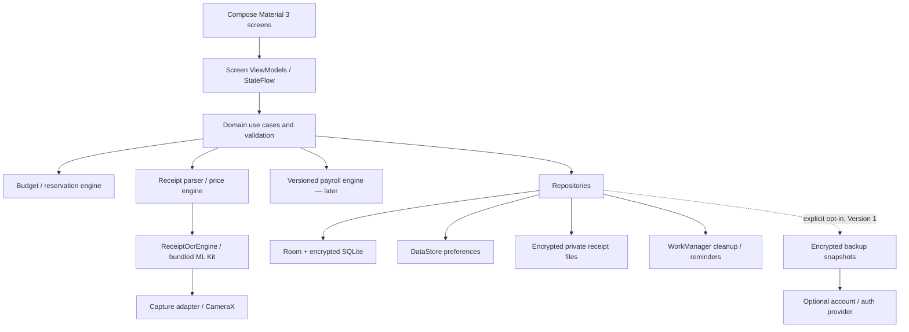
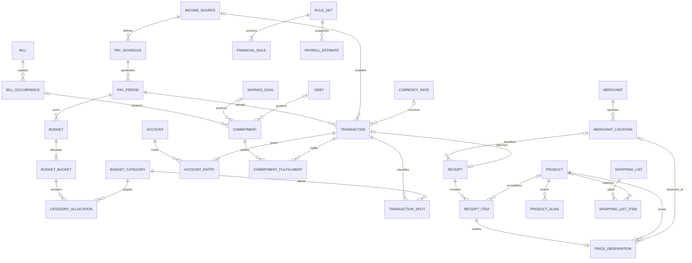
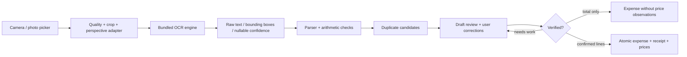

# Phase 4 — Technical and database architecture

Proposal only. No production code, schema migration or remote service exists yet. Financial engines use exact integers/BigDecimal; the HTML prototype is only a design simulator.

## Architecture

Single-activity Kotlin app; Compose UDF, lifecycle-aware state, screen-sized ViewModels and reusable plain state holders. Navigation 3 preferred per current Android documentation; final stable version decision recorded at implementation. Hilt constructor injection where it reduces wiring, no unnecessary use-case wrapper for every CRUD call. Start with feature packages and core domain/data/OCR packages; split Gradle modules only when build boundaries justify it.

Repositories own transactions and coordinate related records. Domain engines: ScheduleCalculator, AllocationEngine, ReservationEngine, ReceiptReconciler, DuplicateMatcher, UnitPriceNormalizer, ShoppingEstimator. Pure calculations accept injected clock/zone/rule-set, return explanation objects and explicit errors. UI never writes balances or OCR output directly to Room.

Room alone is **not** database encryption. Evaluate a maintained encrypted SQLite driver compatible with Room (e.g. SQLCipher) before pinning dependencies/licensing. Android Keystore wraps random data keys; separate image key scope where practical. DataStore stores nonsensitive preferences, not tokens/receipt content. Avoid deprecated security wrappers as default; use current platform primitives after dependency review.

## Logical ER diagram

Relationships with o| are optional. Unknown product/branch stays nullable; no fabricated identity. Settings/notification preferences are DataStore records. AuditRevision, ReceiptDraft, RecurrenceTemplate, GoalContribution, DebtPayment, OptionalIdentity and BackupManifest support lifecycle/state but are omitted from the diagram for legibility.

## Keys, major fields and indexes

All Room records use UUID primary keys, creation/update timestamps and revision numbers. Amounts: checked signed 64-bit minor units plus ISO currency; fractional quantity/package size: decimal text canonicalised with scale/unit. Never Float/Double for financial values. Date-only obligations/schedules use LocalDate; events preserve Instant plus original zone/printed time when known. Foreign keys enabled.

| Entity | Major fields / foreign keys | Indexes and constraints |
|---|---|---|
| IncomeSource | id PK, type, label, currency, variable | type/name |
| PaySchedule | id PK, incomeSourceId FK, frequency, anchors, zone, month-end policy | incomeSourceId; anchors validated |
| PayPeriod | id PK, scheduleId FK, startDate, endExclusive, incomeBasis | unique(scheduleId,startDate); start < end |
| Account | id PK, type, currency, openingMinor, liquidEligible, protected | currency/type; archived accounts retained |
| Transaction | id PK, type, payPeriodId/sourceId/refundOfId/rateId FK nullable, currency, amountMinor, occurredAt, idempotencyKey | unique(idempotencyKey), occurredAt, period/type; typed amount rules |
| AccountEntry | id PK, transactionId/accountId FK, signedMinor | transactionId, accountId/date lookup; same-currency transfers sum zero |
| TransactionSplit | id PK, transactionId/categoryId FK, bucketId nullable, signed budget effect | transactionId, categoryId; sum enforced in atomic domain save |
| Budget / Bucket | id PK, periodId/budgetId FK, revision, currency, targetMinor, shareBp | budget revision uniqueness; exactly 3 buckets for percent method, total 10000bp |
| BudgetCategory / Allocation | id PK, custom label, default bucket; allocation categoryId/bucketId FK, plannedMinor, rollover policy | unique(bucketId,categoryId); classification override preserved |
| Bill / Occurrence | id PK, recurrence, amount basis, category/account FK; occurrence billId FK, dueDate, amountMinor, settledMinor | unique(billId,dueDate,sequence), dueDate/status |
| Commitment | id PK, billOccurrenceId/goalId/debtId FK nullable, periodId/accountId FK, amountMinor, status | exactly one source or explicit custom reserve; unique(source occurrence,purpose), period/status |
| Fulfillment | id PK, commitmentId/transactionId FK, appliedMinor | unique(commitmentId,transactionId); sum bounded, refunds reverse fulfillment |
| Merchant / Location | id PK, merchantId FK, name, address, parish, optional coarse coordinates | merchantId/parish; uncertain name match not unique |
| Receipt | id PK, transactionId/locationId FK nullable, draft/status, printed date/time/currency/number, raw OCR, confirmed totals, image ref/fingerprint, parser version | unique(transactionId) when attached; location/date/total; receipt number not globally unique |
| ReceiptItem | id PK, receiptId/productId FK nullable, raw text, corrected text, quantity, unitMinor, lineMinor, discounts/tax, review flags | receiptId/order, productId; quantity >0 except separate return-line representation |
| Product / Alias | id PK, brand/name/variant/size/unit/barcode; alias productId FK, scope, raw token, confirmed | barcode nonunique for ambiguous/manual entries; alias(scope,token) lookup |
| PriceObservation | id PK, receiptItemId/productId/locationId FK, purchasedDate, finalPaidMinor, comparableMinor, pack/quantity, currency, promotion | unique(receiptItemId), product/currency/date, product/location/date |
| ShoppingList / Item | id PK; listId/productId FK nullable, quantity/size/brand, optional flag, manual estimate | listId/order; quantity >0; unknown price nullable |
| Goal / Contribution | id PK, targetMinor, protected account, currency; goalId/transactionId FK | currency/status; no duplicated account earmarking |
| Debt / Payment | id PK, liability account, principal, APR assumptions, minimum, due date; debtId/transactionId FK | dueDate/status; principal and interest separate |
| RuleSet / FinancialRule | id PK, jurisdiction/version/status; setId FK, category/type/basis/dependencies, percentage/bands/ceiling, effective interval, source URL/verified date | unique(jurisdiction,version), category/effective; no ambiguous overlapping active rules |
| CurrencyRate | id PK, pair, decimal rate, asOf, source, buy/sell/user basis | pair/asOf; >0; original transaction values immutable |

Foreign key policy: financial accounts/categories archive or RESTRICT when referenced. Deleting receipt removes observations/items and image, with explicit independent decision for linked expense. Product merges are reversible reviewed operations; no merchant auto-merge based solely on OCR. Audit corrections preserve prior revision locally without copying unnecessary raw identifiers indefinitely. Delete-all purges audit history too.

## Money invariants

Balances derive from opening entries + ledger entries, not repeatedly mutated cached totals. Caches are reproducible, versioned and disposable. A transaction creates entries, splits, receipt link and commitment fulfillment in one DB transaction; idempotency key survives retry/process death. Transfers between currencies require two amounts and explicit conversion details, with fees separated. Cash withdrawal is a transfer, not an expense. Credit-card purchase is expense once; card payment is transfer reducing liability, not a second expense. Opening debt predating tracking has a minimum-payment commitment; avoid counting both its protected purchase and payment reserve.

Budget targets are allocations, not cash movements. Account inclusion and reservations are explicit. Safe pool sums same-currency eligible assets only. ReservationEngine subtracts outstanding commitments once, with fulfillment linked to posted records. Bills at the exact next payday are protected until the user confirms income timing; disclose that conservative boundary choice. Already funded savings in an excluded account has no outstanding reserve. Negative commitments/overfulfillment rejected; partial payment supported.

Money allocation rounds once in minor units using deterministic largest remainder. Unit price and FX use BigDecimal with explicit precision/rounding; storage overflow checked before conversion. Output includes exact explanation inputs for UI and tests. “Expected” income never enters actual safe-to-spend; show a separate labelled forecast.

## Receipt-processing architecture

Capture state machine: draft/captured/processing/reviewing/confirmed/failed. Durable private draft ID; rerun keyed by image and parser version. Quality checks are heuristics with helpful retake guidance. Long receipts support multiple cropped pages later, with overlap deduplication; never silently drop bottom totals. Region evidence links field values back to image. Receipt maths recognises tax-inclusive versus exclusive totals and receipt-level discounts; no blanket GCT applied to every item. Reconciliation tolerance proposed one cent for exact totals, with explicit rounding adjustment for printed rounding; no hidden tolerance used to invent prices.

Product aliases learn only confirmed corrections, scoped conservatively to merchant when useful. Raw text and parser suggestion never overwrite authoritative corrected fields. Save failures retain review; probable duplicates are advisory. Total-only receipts allow the user to continue while excluding untrusted lines from history.

## Price and shopping engine

Observation identity includes variant, currency, quantity, package contents and branch. Unit paid price = comparable final item amount / total compatible package units; promotions/member-only prices tagged. Weighted products use actual weight, not a guessed pack size. Price stats use selected product/currency/branch/range, show observation count, last date, min/max/mean/median and outliers; do not silently drop unusual values. Editing receipt invalidates derived observations in the same transaction.

For preferred branch: choose newest exact confirmed observation within recent window; otherwise show stale newest or user-entered assumption. No cross-branch fallback hidden. Estimate sums quantity × each selected price, reports selection provenance and unknown coverage. Range spans relevant recent observations or explicitly entered assumptions; not a guarantee or statistical confidence band. List checkmarks mean “picked up”, not “expense recorded”; saving reviewed receipt posts financial impact.

## Notifications, backups and resilience

WorkManager performs eventual reminders/cleanup, not exact-time guarantees. Request Android notification permission contextually; notifications conceal amounts by default. Schedule occurrences after reboot/timezone/settings changes; no exact-alarm permission for MVP bills.

Local backup: versioned snapshot, ledger/receipt integrity hash, AEAD encryption and passphrase-derived export key (parameters/version recorded). Device Keystore keys are not portable backups. Restore into staging database, validate bounds/relationships/currency/split sums, migrate, then atomic swap with rollback; never destructive fallback. Backup omissions/receipt image choice disclosed.

Version 1 optional account: provider-agnostic auth adapter, short-lived tokens, account-scoped access and server authorisation. Encrypt snapshots before upload; manifest exposes minimal metadata. Recovery uses user-held recovery secret or separately approved recovery design. “Forgot password” cannot magically decrypt end-to-end encrypted data; warn before enabling backup and verify recovery. Backend deletion includes retained object versions and expiry policy. Snapshot restore is reviewed and replaces/merges only by explicit strategy; no automatic multi-device merge. Provider, region, pricing and legal transfer basis remain undecided gates.

Room migrations export schemas and test every supported upgrade; new constraints fail safely. Missing keys show recovery choices, not auto-reset. Kill/OOM/low-storage tests cover each write boundary. SDK upgrades and rules updates never rewrite historical confirmed records.
